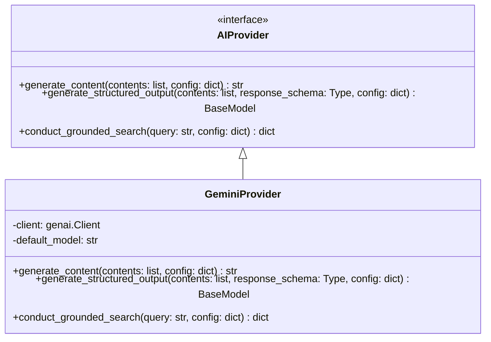
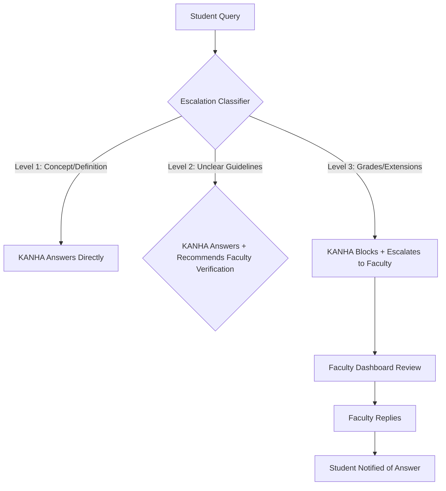

# KANHA — AI Architecture

This document details the AI architecture, provider abstraction layer, and companion response logics for the KANHA platform.

---

## 1. Provider Abstraction Layer

To avoid tightly coupling KANHA to a single model, we implement an abstraction layer. All services request LLM capabilities via interface classes.



### 1.1. Python Code Outline

```python
from abc import ABC, abstractmethod
from typing import Type
from pydantic import BaseModel
from google import genai
from google.genai import types

class AIProvider(ABC):
    @abstractmethod
    async def generate_content(self, contents: list, config: dict = None) -> str:
        pass

    @abstractmethod
    async def generate_structured_output(
        self, 
        contents: list, 
        response_schema: Type[BaseModel], 
        config: dict = None
    ) -> BaseModel:
        pass

    @abstractmethod
    async def conduct_grounded_search(self, query: str, config: dict = None) -> dict:
        pass


class GeminiProvider(AIProvider):
    def __init__(self, api_key: str, default_model: str = "gemini-3.6-flash"):
        self.client = genai.Client(api_key=api_key)
        self.default_model = default_model

    async def generate_content(self, contents: list, config: dict = None) -> str:
        model = (config or {}).get("model", self.default_model)
        gen_config = None
        if config and "system_instruction" in config:
            gen_config = types.GenerateContentConfig(
                system_instruction=config["system_instruction"]
            )
        response = self.client.models.generate_content(
            model=model,
            contents=contents,
            config=gen_config
        )
        return response.text

    async def generate_structured_output(
        self, 
        contents: list, 
        response_schema: Type[BaseModel], 
        config: dict = None
    ) -> BaseModel:
        model = (config or {}).get("model", self.default_model)
        # Note: google-genai structured output configuration
        # response_schema is passed in as type config parameter
        response = self.client.models.generate_content(
            model=model,
            contents=contents,
            config=types.GenerateContentConfig(
                response_mime_type="application/json",
                response_schema=response_schema
            )
        )
        return response_schema.model_validate_json(response.text)

    async def conduct_grounded_search(self, query: str, config: dict = None) -> dict:
        model = (config or {}).get("model", self.default_model)
        # Configure Google Search grounding tool
        search_tool = types.Tool(google_search=types.GoogleSearch())
        
        response = self.client.models.generate_content(
            model=model,
            contents=query,
            config=types.GenerateContentConfig(
                tools=[search_tool]
            )
        )
        
        # Parse grounding metadata (citations, source URLs)
        grounding_metadata = getattr(response.candidates[0], "grounding_metadata", None)
        sources = []
        if grounding_metadata:
            for chunk in getattr(grounding_metadata, "grounding_chunks", []):
                web_source = getattr(chunk, "web", None)
                if web_source:
                    sources.append({
                        "title": getattr(web_source, "title", "Web Page"),
                        "url": getattr(web_source, "uri", "")
                    })
                    
        return {
            "answer": response.text,
            "sources": sources
        }
```

---

## 2. Companion Persona & Response Guidelines

KANHA behaves as a supportive, brother-like study companion. Its personality settings:
*   **Encouraging & Patient**: Never scold students for incomplete or imperfect drafts.
*   **Transparent**: Clearly identify as an AI assistant. Never pretend to be human.
*   **Direct & Conversational**: Use simple English, bulleted lists, and friendly formatting.

---

## 3. Decision Escalation Engine



### 3.1. Level Classification Definitions
*   **Level 1 (AI answers directly)**: Definition of fabrics, design movements, garment types, history, or basic technique descriptions.
*   **Level 2 (AI suggests faculty check)**: Conflicting information on assignment instructions. KANHA analyzes standard files and context, answers, but prompts: *"Remember to check with your faculty member to confirm this."*
*   **Level 3 (Escalation to human)**: Grade disputes, assignment deadlines extensions, attendance adjustments, syllabus changes. KANHA must output: *"Deadline extension requests require faculty approval. I've sent a help ticket with our request to your teacher."*
