# KANHA — Chat Architecture

This document describes the design of KANHA's real-time communication system.

---

## 1. WebSocket Connections

Real-time chat is established via WebSockets. All connection requests are verified using a JWT access token:

`ws://localhost:8000/api/v1/ws/chat?token={JWT_TOKEN}`

```mermaid
sequenceDiagram
    participant Client as React Client
    participant Manager as WebSocketManager (FastAPI)
    participant DB as Relational Database

    Client->>Manager: Connect with Token
    Note over Manager: Verifies User Identity & Role
    Manager-->>Client: Connection Accepted
    
    rect rgb(28, 37, 65)
        Note over Client, Manager: Realtime Chat Loop
        Client->>Manager: Send Message JSON
        Manager->>DB: Save Message (is_read=false)
        Manager-->>Client: Echo Sent Status
        Manager-->>Client (Recipient): Forward Message
    end
```



---

## 2. Event Payload Schema

To coordinate interactions, client and server communicate via standardized JSON message frames:

### 2.1. Client sending a message
```json
{
  "type": "chat_send",
  "data": {
    "conversation_id": 12,
    "content": "Can I use linen instead of cotton for this task?"
  }
}
```

### 2.2. Typing Indicators
When a user starts typing, the client dispatches a typing signal (capped at once per 3 seconds):
```json
{
  "type": "typing",
  "data": {
    "conversation_id": 12,
    "is_typing": true
  }
}
```

### 2.3. Reading Receipts
Sent when a user opens a conversation window:
```json
{
  "type": "read_receipt",
  "data": {
    "conversation_id": 12,
    "last_read_message_id": 456
  }
}
```

---

## 3. Streaming AI Responses (Student ↔ KANHA)

For KANHA chat interactions:
1.  The client sends a message frame targetted to KANHA's system ID.
2.  The backend calls the Gemini model asynchronously.
3.  The response chunks are streamed via the WebSocket connection as soon as they are received from the Google GenAI SDK.
4.  This reduces perceived latency and allows the student to read the explanation in real-time.

```json
{
  "type": "ai_chunk",
  "data": {
    "conversation_id": 12,
    "content": "Linen has a beautiful, natural drape that works well, but... "
  }
}
```
At the end of generation, a final frame containing the completed message ID is sent:
```json
{
  "type": "ai_done",
  "data": {
    "conversation_id": 12,
    "message_id": 789
  }
}
```
