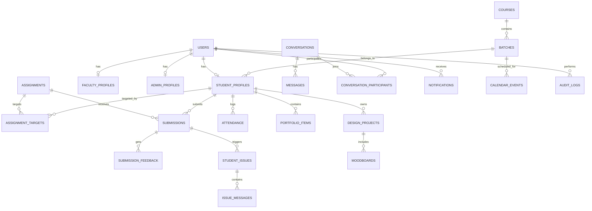

# KANHA — Database Architecture

This document outlines the normalized relational database schema designed for KANHA. The schema targets **PostgreSQL** in production and is compatible with **SQLite** for local development using SQLAlchemy types.

---

## 1. Schema Diagram & Relationships

---

## 2. Table Definitions

### 2.1. Core Identity & Roles
*   **`users`**
    *   `id` (UUID / Integer, Primary Key)
    *   `email` (VARCHAR, Unique, Indexed)
    *   `hashed_password` (VARCHAR)
    *   `first_name` (VARCHAR)
    *   `last_name` (VARCHAR)
    *   `role` (VARCHAR: `STUDENT`, `FACULTY`, `ADMIN`)
    *   `is_active` (BOOLEAN)
    *   `created_at` (TIMESTAMP WITH TIMEZONE)
    *   `updated_at` (TIMESTAMP WITH TIMEZONE)

*   **`student_profiles`**
    *   `id` (UUID / Integer, Primary Key)
    *   `user_id` (FK to `users.id`, Unique)
    *   `batch_id` (FK to `batches.id`)
    *   `enrollment_number` (VARCHAR, Unique)

*   **`faculty_profiles`**
    *   `id` (UUID / Integer, Primary Key)
    *   `user_id` (FK to `users.id`, Unique)
    *   `employee_id` (VARCHAR, Unique)

*   **`admin_profiles`**
    *   `id` (UUID / Integer, Primary Key)
    *   `user_id` (FK to `users.id`, Unique)

### 2.2. Academic Structures
*   **`courses`**
    *   `id` (UUID / Integer, Primary Key)
    *   `name` (VARCHAR)
    *   `code` (VARCHAR, Unique)
    *   `description` (TEXT)

*   **`batches`**
    *   `id` (UUID / Integer, Primary Key)
    *   `course_id` (FK to `courses.id`)
    *   `name` (VARCHAR)
    *   `academic_year` (VARCHAR, e.g. "2026-2027")

---

### 2.3. Assignment & Submission System
*   **`assignments`**
    *   `id` (UUID / Integer, Primary Key)
    *   `title` (VARCHAR)
    *   `description` (TEXT)
    *   `faculty_id` (FK to `faculty_profiles.id`)
    *   `start_date` (TIMESTAMP WITH TIMEZONE)
    *   `deadline` (TIMESTAMP WITH TIMEZONE)
    *   `status` (VARCHAR: `DRAFT`, `PUBLISHED`, `CANCELLED`)
    *   `priority` (VARCHAR: `LOW`, `MEDIUM`, `HIGH`)
    *   `category` (VARCHAR, e.g. "Illustration", "Textiles")
    *   `grading_criteria` (TEXT)

*   **`assignment_targets`**
    *   `id` (UUID / Integer, Primary Key)
    *   `assignment_id` (FK to `assignments.id`)
    *   `student_id` (FK to `student_profiles.id`, Nullable)
    *   `batch_id` (FK to `batches.id`, Nullable)

*   **`submissions`**
    *   `id` (UUID / Integer, Primary Key)
    *   `assignment_id` (FK to `assignments.id`)
    *   `student_id` (FK to `student_profiles.id`)
    *   `submitted_at` (TIMESTAMP WITH TIMEZONE)
    *   `status` (VARCHAR: `SUBMITTED`, `UNDER_REVIEW`, `REVISION_REQUIRED`, `APPROVED`, `OVERDUE`)
    *   `submission_text` (TEXT)
    *   `file_url` (VARCHAR, Nullable)

*   **`submission_feedback`**
    *   `id` (UUID / Integer, Primary Key)
    *   `submission_id` (FK to `submissions.id`)
    *   `faculty_id` (FK to `faculty_profiles.id`)
    *   `feedback_text` (TEXT)
    *   `grade` (VARCHAR, Nullable)
    *   `created_at` (TIMESTAMP WITH TIMEZONE)

---

### 2.4. Support & Escalation (KANHA Doubt/Help System)
*   **`student_issues`**
    *   `id` (UUID / Integer, Primary Key)
    *   `student_id` (FK to `student_profiles.id`)
    *   `assignment_id` (FK to `assignments.id`, Nullable)
    *   `faculty_id` (FK to `faculty_profiles.id`)
    *   `category` (VARCHAR: `INSTRUCTION_HELP`, `TECHNIQUE_HELP`, `RESEARCH_HELP`, `SUBMISSION_PROBLEM`, `EXTENSION_REQUEST`, `OTHER`)
    *   `description` (TEXT)
    *   `status` (VARCHAR: `OPEN`, `RESOLVED`, `ESCALATED`)
    *   `escalation_level` (INTEGER: `1`, `2`, `3`)
    *   `created_at` (TIMESTAMP WITH TIMEZONE)

*   **`issue_messages`**
    *   `id` (UUID / Integer, Primary Key)
    *   `issue_id` (FK to `student_issues.id`)
    *   `sender_id` (FK to `users.id`)
    *   `content` (TEXT)
    *   `is_ai_response` (BOOLEAN)
    *   `created_at` (TIMESTAMP WITH TIMEZONE)

---

### 2.5. Realtime Messages
*   **`conversations`**
    *   `id` (UUID / Integer, Primary Key)
    *   `created_at` (TIMESTAMP WITH TIMEZONE)

*   **`conversation_participants`**
    *   `id` (UUID / Integer, Primary Key)
    *   `conversation_id` (FK to `conversations.id`)
    *   `user_id` (FK to `users.id`)

*   **`messages`**
    *   `id` (UUID / Integer, Primary Key)
    *   `conversation_id` (FK to `conversations.id`)
    *   `sender_id` (FK to `users.id`)
    *   `content` (TEXT)
    *   `is_read` (BOOLEAN DEFAULT FALSE)
    *   `created_at` (TIMESTAMP WITH TIMEZONE)

---

### 2.6. Centralized Notifications & Calendar
*   **`notifications`**
    *   `id` (UUID / Integer, Primary Key)
    *   `user_id` (FK to `users.id`)
    *   `title` (VARCHAR)
    *   `message` (TEXT)
    *   `event_type` (VARCHAR)
    *   `is_read` (BOOLEAN DEFAULT FALSE)
    *   `created_at` (TIMESTAMP WITH TIMEZONE)

*   **`calendar_events`**
    *   `id` (UUID / Integer, Primary Key)
    *   `title` (VARCHAR)
    *   `description` (TEXT)
    *   `event_type` (VARCHAR: `CLASS`, `DEADLINE`, `REVIEW`, `EVENT`, `HOLIDAY`)
    *   `start_time` (TIMESTAMP WITH TIMEZONE)
    *   `end_time` (TIMESTAMP WITH TIMEZONE)
    *   `batch_id` (FK to `batches.id`, Nullable)
    *   `created_by` (FK to `users.id`)

*   **`attendance`**
    *   `id` (UUID / Integer, Primary Key)
    *   `student_id` (FK to `student_profiles.id`)
    *   `calendar_event_id` (FK to `calendar_events.id`)
    *   `status` (VARCHAR: `PRESENT`, `ABSENT`, `LATE`, `EXCUSED`)
    *   `marked_at` (TIMESTAMP WITH TIMEZONE)

---

### 2.7. Design & Portfolio (Design Studio)
*   **`design_projects`**
    *   `id` (UUID / Integer, Primary Key)
    *   `student_id` (FK to `student_profiles.id`)
    *   `name` (VARCHAR)
    *   `inspiration_source` (TEXT)
    *   `fabric_notes` (TEXT)
    *   `color_palette` (VARCHAR)
    *   `created_at` (TIMESTAMP WITH TIMEZONE)

*   **`moodboards`**
    *   `id` (UUID / Integer, Primary Key)
    *   `project_id` (FK to `design_projects.id`)
    *   `name` (VARCHAR)
    *   `created_at` (TIMESTAMP WITH TIMEZONE)

*   **`moodboard_items`**
    *   `id` (UUID / Integer, Primary Key)
    *   `moodboard_id` (FK to `moodboards.id`)
    *   `item_type` (VARCHAR: `AI_CONCEPT`, `SKETCH`, `REFERENCE_IMAGE`, `COLOR_SWATCH`, `TEXT_NOTE`)
    *   `file_url` (VARCHAR)
    *   `caption` (TEXT)
    *   `source_url` (VARCHAR, Nullable)
    *   `source_title` (VARCHAR, Nullable)
    *   `is_ai_generated` (BOOLEAN DEFAULT FALSE)
    *   `position_x` (INTEGER DEFAULT 0)
    *   `position_y` (INTEGER DEFAULT 0)

*   **`portfolio_items`**
    *   `id` (UUID / Integer, Primary Key)
    *   `student_id` (FK to `student_profiles.id`)
    *   `title` (VARCHAR)
    *   `category` (VARCHAR: `ILLUSTRATION`, `GARMENT_DESIGN`, `TEXTILES`, `EMBROIDERY`, `PHOTOGRAPHY`, `ASSIGNMENTS`, `FINAL_PROJECTS`)
    *   `description` (TEXT)
    *   `file_url` (VARCHAR)
    *   `created_at` (TIMESTAMP WITH TIMEZONE)

---

### 2.8. System logs & Audits
*   **`audit_logs`**
    *   `id` (UUID / Integer, Primary Key)
    *   `user_id` (FK to `users.id`, Nullable)
    *   `action` (VARCHAR)
    *   `details` (TEXT)
    *   `ip_address` (VARCHAR, Nullable)
    *   `timestamp` (TIMESTAMP WITH TIMEZONE)
