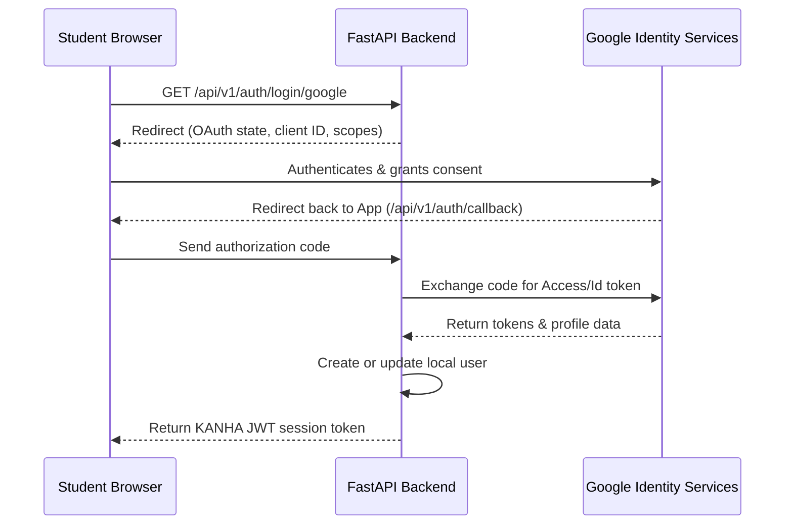

# KANHA — Google Integrations Architecture

This document describes the design for KANHA's Google integrations, focusing on Google OAuth, Calendar, and Drive.

---

## 1. Authentication Integration (Google OAuth 2.0)

For web framework compatibility and CSRF security, KANHA uses **`Authlib`** to manage OAuth redirect and callback logic rather than local-browser-based scripts.

### 1.1. Scopes Requested
Google OAuth integration is configured with the following scopes (least-privilege):
*   `openid` (Identity information)
*   `email` (Email address)
*   `profile` (Profile photo and name)
*   `https://www.googleapis.com/auth/calendar.events` (Optional: read/write academic milestones)
*   `https://www.googleapis.com/auth/drive.readonly` (Optional: view faculty attachments)

---

## 2. Google Calendar Synchronization

*   **Optional Behavior**: If a user has not linked their Google account, KANHA's calendar falls back to local database entries stored in `calendar_events`.
*   **Synchronization Flow**:
    1.  Faculty creates a review milestone or assignment deadline.
    2.  FastAPI dispatches `CALENDAR_EVENT_CREATED`.
    3.  A handler checks if the target batch has authorized Google Calendar connection details.
    4.  If yes, it uses the saved token to call Google Calendar API and insert the event:
        *   `googleapiclient.discovery.build('calendar', 'v3', credentials=credentials)`
        *   Updates the event description with assignment instructions and links.

---

## 3. Google Drive Integration

*   **Resource Attachment**: Faculty members can choose to link files directly from their Google Drive (such as study slides or rubrics).
*   **Retrieval Flow**:
    1.  Faculty selects a file from the Google Drive file picker (handled client-side).
    2.  The file metadata (Google Drive ID, name, download link) is saved to the assignment record.
    3.  When a student views the assignment, the client requests the resource download from the backend.
    4.  The backend streams the file content using the backend's Google API credentials or redirect URL, ensuring the student does not get direct administrative access to the faculty's drive.
*   **Security Bounds**: The system checks if the requesting student is targeted by the assignment before fetching/streaming the file, protecting private files from unauthorized downloads.
