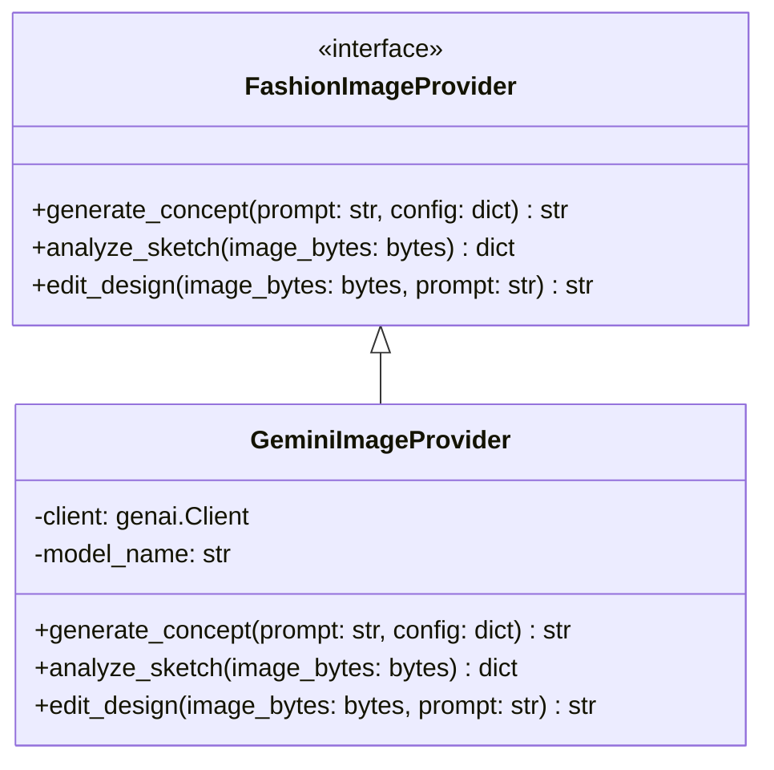

# KANHA — Image Generation & Design Studio Architecture

This document describes the design of KANHA's Fashion Design Studio and Image Generation pipeline.

---

## 1. Provider Abstraction

To ensure modularity and easily handle Google model deprecations, KANHA abstracts image generation through a provider system:

*   **Configurable Models**: The image generation model is specified in `.env` as `GEMINI_IMAGE_MODEL` (e.g. `gemini-2.5-flash-image` or equivalent recommended Gemini image generation configurations), preventing hard-coded models throughout python modules.

---

## 2. Core Image Workflows

### 2.1. Text-to-Design
*   **Prompt Structuring**: The Design Studio interface guides the student through options: silhouette (e.g. Lehenga, Anarkali), fabric (e.g. silk, linen), color palette, and embroidery (e.g. Zardozi).
*   **Prompt Assembly**: The backend service builds a prompt: *"A detailed fashion illustration front view of a modern [silhouette] made of [fabric] in [colors] with [embroidery] motifs. Clean background, fashion design studio concept board."*
*   **AI Labeling**: All generated assets must have metadata `is_ai_generated: true` in the `moodboard_items` or `portfolio_items` table and must display an **"AI Generated Concept"** watermark badge in the UI.

### 2.2. Image-to-Design (Sketch Upload)
*   **Analysis Workflow**:
    1.  Student uploads their pencil sketch.
    2.  The backend calls `client.models.generate_content` (Gemini Multimodal) with the image bytes and a prompt: *"Analyze this fashion sketch. Identify the silhouette, style lines, necklines, and design components. Provide recommendations for suitable fabrics, colors, and embroidery techniques."*
    3.  Returns structured recommendations to the student.
    4.  Allows generating a rendered concept based on the analyzed sketch.

### 2.3. Moodboard System
*   Moodboards are structured grid layouts where students can drag, drop, and organize references.
*   **Item Types**: Sketch, Reference Image (web source), AI Concept, or Color Swatch.
*   **Source Attribution**: For third-party reference images, students must input a URL and title, which is stored in `source_url` and `source_title` to prevent claim of ownership.
