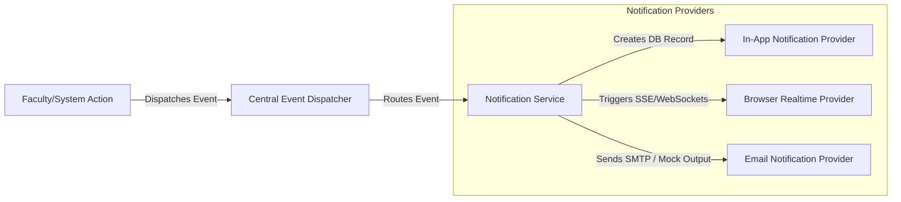

# KANHA — Notification Architecture

This document describes the centralized event-driven notification service of the KANHA platform.

---

## 1. Notification Event Pipeline

To ensure notification generation is cleanly decoupled from business modules, we implement an event-driven notification pipeline.



### 1.1. Core Notification Events
*   `ASSIGNMENT_CREATED`: Triggered when an assignment is saved as a draft. No notifications sent.
*   `ASSIGNMENT_PUBLISHED`: Sent to all students targeted by the assignment.
*   `ASSIGNMENT_DUE_SOON`: Sent 24 hours and 2 hours before a deadline.
*   `ASSIGNMENT_OVERDUE`: Sent when deadline passes and submission is missing.
*   `SUBMISSION_RECEIVED`: Sent to the faculty member who created the assignment.
*   `SUBMISSION_REVIEWED` / `REVISION_REQUESTED`: Sent to the student when feedback is uploaded.
*   `STUDENT_HELP_REQUESTED`: Sent to the designated faculty member (Level 3 escalation).
*   `FACULTY_HELP_RESPONSE`: Sent to the student when the faculty replies to an escalated issue.
*   `ANNOUNCEMENT_CREATED`: Sent to all students in the target batch.

---

## 2. Notification Service Implementation Outline

All modules generate notifications by publishing events:

```python
from abc import ABC, abstractmethod
from typing import List
from pydantic import BaseModel

class NotificationPayload(BaseModel):
    user_id: int
    title: str
    message: str
    event_type: str

class NotificationProvider(ABC):
    @abstractmethod
    async def send(self, payload: NotificationPayload) -> bool:
        pass


class InAppNotificationProvider(NotificationProvider):
    async def send(self, payload: NotificationPayload) -> bool:
        # Inserts record into `notifications` database table
        # Updates SSE/WebSocket alerts for unread badge count
        return True


class EmailProvider(NotificationProvider):
    async def send(self, payload: NotificationPayload) -> bool:
        # Development mode: logs to standard console or mock output
        # Production mode: sends via secure SMTP/SES
        return True


class NotificationService:
    def __init__(self, providers: List[NotificationProvider]):
        self.providers = providers

    async def dispatch_notification(self, payload: NotificationPayload):
        for provider in self.providers:
            try:
                await provider.send(payload)
            except Exception as e:
                # Logs failure to observability logging system
                pass
```
