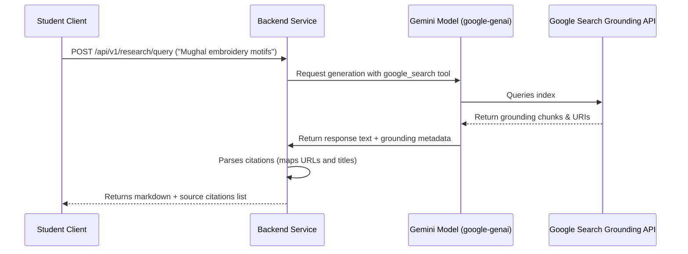

# KANHA — Research Engine Architecture

This document describes KANHA's specialized Fashion Research Engine built with Google Search grounding.

---

## 1. Grounded Search Workflow

To prevent hallucinations in history and contemporary collections, KANHA uses Gemini API Google Search Grounding to anchor answers to actual source documents.



---

## 2. Structured Citation Formats

Research queries return a structured response containing:
1.  **Response Text**: Markdown format with numbered citations (e.g. `[1]`, `[2]`).
2.  **Citations Reference List**: Maps keys to source URL, domain, page title, and access date.

### Example JSON Response Schema
```json
{
  "query": "Banarasi saree weaving history",
  "grounded_text": "Banarasi sarees originated in Varanasi, India, and are famous for their gold and silver brocade or zari [1]. The weaving traditions were heavily influenced by Mughal design elements [2]...",
  "citations": [
    {
      "index": 1,
      "title": "The History of Banarasi Sarees - National Museum India",
      "url": "https://www.nationalmuseumindia.gov.in/banarasi-history"
    },
    {
      "index": 2,
      "title": "Mughal Influences in Indian Textiles",
      "url": "https://www.jstor.org/stable/mughal-textiles"
    }
  ]
}
```

---

## 3. Specialized Fashion Research Fields

The Research Engine contains custom prompting rules tailored to handle fashion-specific questions:
*   **Indian Textiles**: Jamdani, Banarasi, Chanderi, Kanjeevaram, Patola, Ikat.
*   **Traditional Costumes**: Ghagra Choli, Angrakha, Achkan, Mundum Neryathum.
*   **Textile Techniques**: Block printing, Ajrakh, Kalamkari, Shibori, Tie-dye.
*   **Embroidery**: Chikankari, Phulkari, Zardozi, Kantha, Kashida, Mirror work.
*   **Silhouettes & Tailoring**: Historical silhouettes (crinoline, bustle) and Indian structures.
*   **Sustainable & Contemporary Fashion**: Organic dyes, handloom preservation, and modern designers.

---

## 4. Citation Policy & Legal Compliance

> [!IMPORTANT]
> To comply with copyright guidelines and fair use rules, citations and source text displayed by KANHA must stay limited to **short excerpts** and summary reference points. KANHA must **never reproduce full source documents** or display verbatim chapters from referenced websites.

