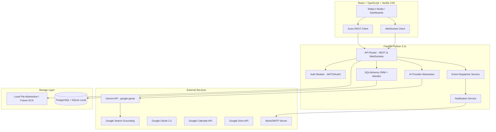

# KANHA — System Architecture

This document describes the high-level system architecture of the KANHA learning platform.

---

## 1. Architectural Layers

### 1.1. Frontend Client
*   **Framework**: React 18, TypeScript, and Vite.
*   **Styling**: Vanilla CSS utilizing custom variables for the SFI brand identity:
    *   **Navy** (Canvas & Dark surfaces): `--color-navy-base`, `--color-navy-surface`
    *   **Gold** (Primary brand marks & borders): `--color-gold-primary`
    *   **Pink/Rose** (Secondary highlights & hover states): `--color-rose-secondary`
*   **Protocols**:
    *   **REST (HTTP)**: Used for CRUD operations (fetching assignments, submitting work, managing directories).
    *   **WebSockets**: Used for real-time chat (Student ↔ Faculty, KANHA chat streaming, typing indicators).
    *   **Lightweight Polling / SSE**: Used for real-time in-app notification count and task status updates (to avoid unnecessary WebSocket overhead).

### 1.2. Backend Application
*   **Framework**: FastAPI.
*   **Structure**: Clean Monorepo Backend. Modules are organized by domain (auth, assignments, notifications, chat, etc.) with a clear separation of routing, services, and models.
*   **Security & Auth**:
    *   **JWT Tokens**: Secure authentication and session management.
    *   **Role-Based Access Control (RBAC)**: Enforced via FastAPI dependencies checking the user's role claim. Strict boundary tests verify that students cannot access faculty/admin endpoints and cannot access other students' private portfolios/submissions.
*   **Database Integration**:
    *   **SQLAlchemy ORM**: Mapped to models.
    *   **Alembic**: Database migrations management.
    *   **Compatibility**: Target database is **PostgreSQL**. Development uses **SQLite** but avoids SQLite-specific logic. Columns use database-agnostic types (e.g. timezone-aware datetimes, explicit string sizes).

### 1.3. AI Provider Layer
*   **Library**: Official `google-genai` Python SDK.
*   **Abstraction**:
    *   `AIProvider` base class.
    *   `GeminiProvider` implementation.
    *   Model names (e.g. `gemini-2.5-flash`) are managed via environment config variables to allow flexible switching.
*   **Research & Grounding**: Gemini is configured with `google_search` tools to retrieve search citations, ensuring source title, URL, and metadata are returned.
*   **Image Generation**: `FashionImageProvider` with `GeminiImageProvider` using standard Gemini image generation methods, with configurable model names (e.g. `gemini-2.5-flash-image` or equivalent).

---

## 2. Event-Driven Service Architecture
Rather than inline notification and audit code inside API route handlers, KANHA uses a centralized event dispatcher:

1.  A controller executes a business action (e.g. `publish_assignment`).
2.  The controller dispatches an event (e.g. `ASSIGNMENT_PUBLISHED`).
3.  The **Event Dispatcher** routes the event to registered handlers:
    *   `NotificationService` triggers in-app notification creations and dispatches emails.
    *   `AuditLogger` logs the action to `audit_logs`.
    *   `WebSocketManager` broadcasts updates to active clients.
